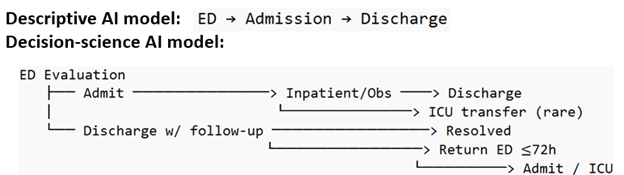
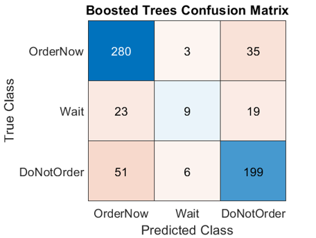
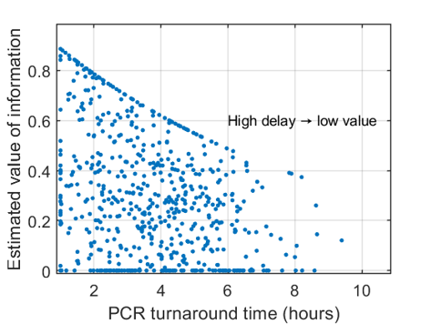
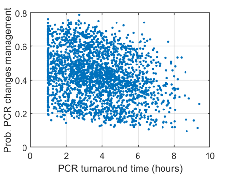
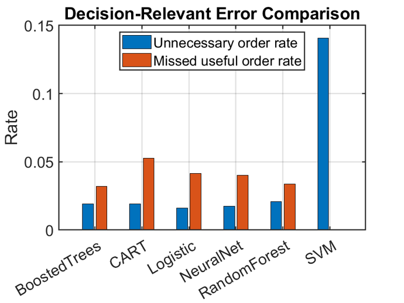

# decision-focused-uncertainty-aware-AI
# Overview

Clinical decision-making is fundamentally different from prediction. In real-world settings, clinicians are not asked to estimate probabilities alone—they must decide between competing actions under uncertainty, often with incomplete, delayed, or conflicting information. Current AI systems largely fail in this regard because they are designed to optimize predictive accuracy rather than decision quality.

This repository addresses that gap by developing and evaluating a decision-focused AI framework that explicitly models actions, their consequences, and the uncertainty that determines which action is most appropriate. Instead of asking “What is the probability of disease?”, the framework asks “Given this uncertainty, what should we do?”

We implement and compare two paradigms: a traditional machine learning model trained to predict outcomes, and a hybrid decision-science model that integrates probabilistic predictions with mechanistic reasoning, utility modeling, and value-of-information. Using a controlled in silico clinical dataset, we evaluate how these approaches differ in terms of decision consistency, clinical alignment, and downstream outcomes.

# Background

Clinical decision-making under uncertainty raises three central questions that motivate this work.

First, if two clinicians evaluate the same patient using the same data, will they make the same decision? In practice, the answer is often no. Variability arises from differences in experience, risk tolerance, and interpretation of uncertain evidence. This inconsistency leads to variability in care, unnecessary interventions, and inequities in outcomes.

Second, which modeling approach actually supports better decisions? Traditional machine learning models are designed to predict outcomes such as infection, deterioration, or readmission risk. However, they do not explicitly evaluate alternative actions or their consequences. As a result, they may achieve high predictive accuracy while still leading to poor or inconsistent decisions.

Third, even if a model performs better in simulation, what changes in practice? A clinically meaningful model must reduce uncertainty in a way that influences real decisions, improves patient outcomes, and aligns with workflow constraints such as timing, resource availability, and diagnostic delays.

This repository is built around these three questions and proposes a shift from descriptive AI to decision-science AI, where the objective is not prediction alone but decision optimization under uncertainty.

# Conceptual Framework

The key distinction in this work is between predictive modeling and decision-focused modeling. A predictive model estimates probabilities, such as the likelihood of infection. A decision-focused model evaluates actions by estimating their expected benefit and harm, taking into account uncertainty, timing, and downstream consequences.

A central concept in this framework is the value of information (VOI), which quantifies whether obtaining additional information (such as a diagnostic test) is worth the delay and cost.

VOI=P(change in management)⋅e
−λ⋅t

This formulation captures a key clinical reality: information loses value over time. A test result that arrives too late may no longer influence management, even if it is accurate.

The hybrid model uses this principle to compare competing actions—such as ordering a test now, waiting, or not ordering at all—and selects the action with the highest expected utility.

#  Data and Simulation Environment

To enable rigorous evaluation, we construct a synthetic clinical–laboratory dataset representing pediatric respiratory infection scenarios. The dataset includes patient demographics, clinical features, laboratory values, diagnostic variables, and outcome measures such as 72-hour return visits and ICU transfer.

Synthetic data is used deliberately to allow full control over the data-generating process, including access to ground truth and the ability to evaluate counterfactual outcomes. This enables direct comparison between observed decisions and optimal decision policies, which is not possible with retrospective real-world data alone.

The dataset is generated using:

generate_synthetic_ehr_cd3.m

and summarized in:

dataset_summary.csv
Data Description.xlsx

# Approach

We compare two fundamentally different modeling paradigms.

The first is a pure machine learning model trained on simulated data to predict outcomes such as infection status and risk of deterioration. While this model performs well in terms of predictive accuracy, it does not explicitly model decisions or compare alternative actions.

The second is a hybrid decision-focused model that integrates probabilistic predictions with mechanistic reasoning and utility-based decision theory. For each patient state, the model evaluates the expected utility of three competing actions: ordering a diagnostic test immediately, delaying the decision, or not ordering the test at all.

This evaluation incorporates multiple factors, including the probability that the test will change management, the risk of unnecessary treatment, the likelihood of deterioration if action is delayed, and the turnaround time of the test. By explicitly modeling these components, the hybrid approach transforms prediction into a decision problem.

The hybrid model is implemented in:

run_hybrid_ml_mechanistic_cd3.m

and evaluated using:

compare_patient_outcomes_cd3.m

# Results

## Overview

The results demonstrate a clear distinction between predictive performance and decision quality.

Pure machine learning models achieve reasonable classification accuracy but produce clinically meaningful errors. These include unnecessary diagnostic testing in low-value scenarios and missed opportunities to test when information could meaningfully alter management. These errors arise because the model is not designed to evaluate the consequences of actions.

In contrast, the hybrid decision-focused model produces decisions that are more consistent, more interpretable, and more aligned with clinical reasoning. By explicitly modeling value-of-information and timing, the model avoids tests that are unlikely to change management and prioritizes tests when they are expected to improve outcomes.

## Outputs of Hybrid Decision Model

Table 1 demonstrates that pure machine learning models produce outputs limited to prediction, such as probabilities of infection (0–1) and risk estimates like 72-hour return, but they do not provide information about the consequences of different actions. The hybrid model extends these outputs by introducing decision-relevant quantities, including the probability that PCR testing will change management (decision impact), the risk of harm such as unnecessary antibiotic use (estimate harm), and operational constraints such as PCR turnaround time (typically 1–14 hours).

The model further computes action-specific utilities—U_OrderNow, U_Wait, and U_DoNotOrder—each typically ranging from about -1 to +2, which represent the expected net benefit of each decision. These utilities allow direct comparison of actions rather than relying on thresholds applied to predicted probabilities. Based on these comparisons, the model produces a final recommendation (1 = order now, 2 = wait, 3 = do not order), along with decision confidence (magnitude of preference) and decision comparison (difference in utilities, ranging approximately from -2 to +2).

Finally, decision consistency (0–1) measures agreement with the optimal policy in simulation. Overall, the table shows that pure ML models answer “what is likely to happen,” whereas the hybrid model answers “what should be done,” by explicitly linking predictions to decisions, timing, and expected outcomes.

### Table 1. Comparison of Hybrid Decision Model vs Pure ML Outputs

| Capability                | Pure ML | Range / Type      | Hybrid Model Clinical Interpretation |
|--------------------------|--------|-------------------|--------------------------------------|
| Predict outcome / state  | Yes    | 0 – 1             | Probability infection is viral       |
| Estimate risk            | Yes    | 0 – 1             | Risk of 72-hour return               |
| Decision impact          | No     | 0 – 1             | Probability PCR will change management |
| Estimate harm            | No     | 0 – 1             | Risk of unnecessary antibiotics      |
| Incorporate timing       | No     | 1 – ~14 hours     | PCR turnaround time                  |
| Value of information     | No     | 0 – 1             | Time-adjusted usefulness of PCR      |
| Utility of ordering now  | No     | (-1 , +2)         | Net benefit of ordering PCR now      |
| Utility of waiting       | No     | (-1 , +2)         | Net benefit of delaying decision     |
| Utility of not ordering  | No     | (-1 , +2)         | Net benefit of avoiding PCR          |
| Final recommendation     | No     | 1, 2, 3           | 1 = Order now, 2 = Wait, 3 = Do not order |
| Decision confidence      | No     | ≥ 0               | Strength of recommendation           |
| Decision comparison      | No     | (-2 , +2)         | Direction and magnitude of preference |
| Decision consistency     | No     | 0 – 1             | Agreement with optimal strategy (simulation only) |

Figure 1 shows the difference between predictive workflows and decision-focused models that explicitly evaluate alternative actions and their downstream outcomes.

### Figure 1. Descriptive vs Decision-Science AI models for clinical decision pathways

  

## Decision Mechanism

Figure 2 shows that the value of information decreases as turnaround time increases, demonstrating that delayed test results are less useful for decision-making. This supports the model’s incorporation of time-dependent value in evaluating diagnostic strategies. Figure 3 illustrates the relationship between turnaround time and the probability that a test will change clinical management. While there is variability, longer turnaround times tend to reduce the likelihood that test results will meaningfully influence decisions. Figure 4 shows how the model determines whether to order a test by comparing the difference in utility between ordering and not ordering. The decision boundary (near zero) separates regions where testing is beneficial from those where it is not, with higher probabilities of changing management favoring test ordering.

### Figure 2. Impact of PCR turnaround time on value of information

  

### Figure 3. Probability that PCR changes management vs turnaround time

  

### Figure 4. Decision boundary based on probability of changing management

  

## Empirical Results from Simulation

Table 2 shows that the hybrid model achieves Accuracy = 0.5888, MacroF1 = 0.4078, and Balanced Accuracy = 0.4244, indicating moderate agreement with the reference policy across decision classes. More importantly, decision-specific errors are relatively low: the Unnecessary Order Rate is 0.0448, meaning few low-value tests are recommended, and the Missed Useful Order Rate is 0.0848, indicating limited missed opportunities where testing would have changed management. The Decision Consistency Proxy = 0.6096 suggests the model aligns with the optimal policy in a majority of cases. Together, these values indicate that although traditional classification metrics are modest, the model performs well in terms of decision quality and consistency.

### Table 2. Hybrid Model Performance Summary

| Model                  | Accuracy | MacroF1 | BalancedAccuracy | UnnecessaryOrderRate | MissedUsefulOrderRate | DecisionConsistencyProxy |
|-----------------------|---------|--------|------------------|----------------------|------------------------|---------------------------|
| HybridMLMechanistic   | 0.5888  | 0.4078 | 0.4244           | 0.0448               | 0.0848                 | 0.6096                    |

 Figure 5 compares unnecessary order rates and missed useful order rates across models. While most models show moderate trade-offs between the two error types, the SVM model exhibits a very high unnecessary order rate, indicating over-testing. The results emphasize that predictive accuracy alone does not ensure good decision-making performance. Figure 6 compares decision-relevant errors between pure machine learning models and the hybrid model. The hybrid model achieves a better balance between unnecessary testing and missed useful tests, demonstrating improved decision quality through explicit utility-based reasoning.

### Figure 5. Decision-relevant error comparison across machine learning models

  

### Figure 6. Pure ML vs hybrid model error comparison

  

Table 3 compares decision policies using expected outcomes. The PCR Order Rate varies widely, with the SVM model ordering tests in 98.72% of cases (0.9872), indicating substantial overuse, whereas other models such as Random Forest (0.4928) and Logistic Regression (0.5040) show more balanced behavior. Outcome risks are similar but slightly worse for aggressive testing policies: for example, SVM yields Expected_Return72h = 0.1365 and Expected_ICUTransfer = 0.0691, while Random Forest shows 0.1580 and 0.0788, respectively. The Expected_UnnecessaryAbx remains high across models (≈0.35–0.40), contributing to Expected Composite Harm values around 0.165–0.170. Agreement metrics further differentiate models: SVM has low agreement (0.4752 observed, 0.4864 optimal), while Random Forest achieves higher agreement (0.8096 observed, 0.8240 optimal). These results indicate that extreme testing policies do not improve outcomes and that more balanced approaches better align with optimal decision strategies.

### Table 3. Policy-Level Outcome Comparison

| Policy                | PCR_Order_Rate | Expected_Return72h | Expected_ICUTransfer | Expected_UnnecessaryAbx | Expected_CompositeHarm | Decision_Agreement_With_Observed | Decision_Agreement_With_PolicyRef |
|----------------------|---------------|--------------------|----------------------|--------------------------|--------------------------|----------------------------------|-----------------------------------|
| PureML_SVM           | 0.9872        | 0.1365             | 0.0691               | 0.4000                   | 0.1656                   | 0.4752                           | 0.4864                            |
| PureML_Logistic      | 0.5040        | 0.1565             | 0.0775               | 0.3592                   | 0.1694                   | 0.7952                           | 0.8096                            |
| PureML_BoostedTrees  | 0.5152        | 0.1570             | 0.0779               | 0.3601                   | 0.1700                   | 0.7552                           | 0.7600                            |
| PureML_RandomForest  | 0.4928        | 0.1580             | 0.0788               | 0.3582                   | 0.1704                   | 0.8096                           | 0.8240                            |
| PureML_CART          | 0.4960        | 0.1582             | 0.0788               | 0.3585                   | 0.1705                   | 0.7904                           | 0.8016                            |

Figure 7 shows the confusion matrix shows how often the boosted trees model correctly or incorrectly predicts each decision class (Order Now, Wait, Do Not Order). While the model performs well in identifying “Order Now” and “Do Not Order,” it struggles with the “Wait” class, indicating difficulty in capturing intermediate decision states.

### Figure 7. Confusion matrix for boosted trees model

  

Table 4 illustrates how the hybrid model makes patient-specific decisions. For example, patient 622 has U_OrderNow = -0.3200, U_Wait = -0.1766, and U_DoNotOrder = 1.2041, leading to a “Do Not Order” recommendation because the expected utility of not testing is substantially higher. This pattern is consistent across cases, where low pChangeMgmt values (often near 0) indicate that testing is unlikely to influence management. Variables such as pViral, pReturn72h, and pUnnecessaryAbx quantify uncertainty in infection type, clinical risk, and overtreatment, while TAT_hours (e.g., 6–7 hours in several cases) reduces the value of delayed information. These examples demonstrate that the model avoids testing when expected benefit is low and timing reduces usefulness, producing decisions that are both interpretable and aligned with clinical reasoning.

### Table 4. Example Case-Level Decision Explanations (First 5 Patients)

| patient_id | RecommendedAction | U_OrderNow | U_Wait  | U_DoNotOrder | pViral | pChangeMgmt | pReturn72h | pUnnecessaryAbx | TAT_hours |
|-----------|------------------|-----------|--------|--------------|--------|-------------|------------|------------------|-----------|
| 622       | DoNotOrder       | -0.3200   | -0.1766 | 1.2041       | 0.1380 | 0.0094      | 0.1354     | 0.1811           | 6.7039    |
| 2133      | DoNotOrder       | -0.2606   | -0.1753 | 1.1766       | 0.3288 | 0.0000      | 0.1054     | 0.2598           | 6.3708    |
| 1346      | DoNotOrder       | -0.2075   | -0.2012 | 1.1201       | 0.6153 | 0.0000      | 0.0728     | 0.3156           | 7.0691    |
| 287       | DoNotOrder       | -0.1919   | -0.1445 | 1.1560       | 0.3127 | 0.0438      | 0.0291     | 0.2358           | 5.6974    |
| 1602      | DoNotOrder       | -0.1385   | -0.0863 | 1.2046       | 0.2477 | 0.0000      | 0.0543     | 0.3084           | 3.1468    |

#### Results stored in:

#### hybrid_model_comparison.csv
#### policy_outcome_comparison.csv
#### hybrid_case_explanations.csv

These outputs show that the hybrid model improves agreement with the optimal policy, reduces unnecessary interventions, and produces decisions that adapt dynamically to both uncertainty and timing constraints.

A key observation is that the hybrid model’s recommendations are driven by whether a diagnostic test is expected to change management. When this probability is high, the model favors ordering; when it is low, the model avoids testing. This behavior closely mirrors expert clinical reasoning.

# How to Run

Run the full pipeline in three steps:

#### generate_synthetic_ehr_cd3
#### run_hybrid_ml_mechanistic_cd3
#### compare_patient_outcomes_cd3

All scripts are written in MATLAB.

# Clinical Significance

This work addresses a fundamental limitation in current AI systems used in healthcare. By shifting from prediction to decision optimization, the proposed framework reduces variability in clinical decisions, improves alignment with patient-centered outcomes, and provides a principled way to incorporate uncertainty into real-world decision-making.

Rather than optimizing abstract metrics such as AUC, the model directly targets the quality and consistency of decisions that affect patient care.

#  Limitations

This study is based on synthetic data and relies on modeled assumptions about clinical processes, utilities, and probabilities. While this allows controlled evaluation, real-world validation is required before deployment. Additionally, the specification of utility functions may vary across clinical settings and requires careful calibration.

# Citation

Bani-Yaghoub M.
Decision-focused AI methods for clinical decision-making under uncertainty: simulation models and in silico evaluation.
GitHub; 2026.
https://github.com/mby74/decision-focused-uncertainty-aware-AI

# Final Remark

This repository demonstrates a shift from predictive modeling to decision-science AI, where the goal is not only to estimate what might happen, but to determine what should be done under uncertainty.

